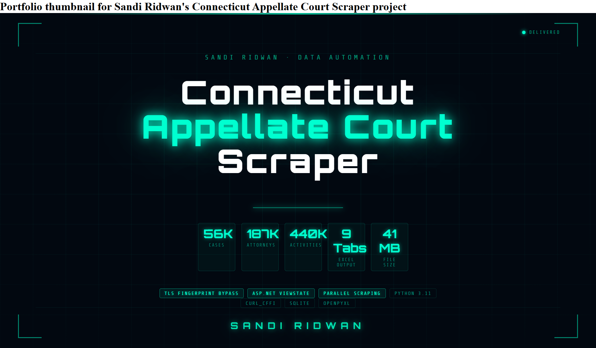

<div align="center">

```
███████╗ █████╗ ███╗   ██╗██████╗ ██╗    ██████╗ ██╗██████╗ ██╗    ██╗ █████╗ ███╗   ██╗
██╔════╝██╔══██╗████╗  ██║██╔══██╗██║    ██╔══██╗██║██╔══██╗██║    ██║██╔══██╗████╗  ██║
███████╗███████║██╔██╗ ██║██║  ██║██║    ██████╔╝██║██║  ██║██║ █╗ ██║███████║██╔██╗ ██║
╚════██║██╔══██║██║╚██╗██║██║  ██║██║    ██╔══██╗██║██║  ██║██║███╗██║██╔══██║██║╚██╗██║
███████║██║  ██║██║ ╚████║██████╔╝██║    ██║  ██║██║██████╔╝╚███╔███╔╝██║  ██║██║ ╚████║
╚══════╝╚═╝  ╚═╝╚═╝  ╚═══╝╚═════╝ ╚═╝    ╚═╝  ╚═╝╚═╝╚═════╝  ╚══╝╚══╝ ╚═╝  ╚═╝╚═╝  ╚═══╝
```

<h1>
  
</h1>


<br/>

[](https://python.org)
[](https://github.com/yifeikong/curl_cffi)
[](https://sqlite.org)
[](https://openpyxl.readthedocs.io)
[](LICENSE)

</div>

---

## ⚡ Overview

A production-grade web scraper for the **Connecticut Judicial Branch Appellate Court** public database — one of the most technically complex government scraping projects due to ASP.NET WebForms stateful architecture and TLS-level bot detection.

```
96,470 CRNs scanned  →  56,598 valid cases  →  9-tab Excel (41.2 MB)
```

| Metric | Value |
|--------|-------|
| Unique cases scraped | **56,598** |
| Party / Attorney rows | **187,590** |
| Case Activity rows | **440,163** |
| Preliminary Papers | **76,081** |
| Briefs & Prepared Record | **98,979** |
| Transcripts & Exhibits | **46,647** |
| Final Excel file size | **41.2 MB** |
| Runtime (5 workers) | **~11 hours** |

---

## 📹 Demo

[]([https://youtube.com/watch?v=-kWFCRtUua8])

> *Click to watch: full scraper run, Excel output walkthrough, and monitor in action*


## 🧠 Technical Challenges Solved

### 1. TLS Fingerprint Bypass
Standard `requests` library is rejected at SSL handshake level (not HTTP 403 — connection reset at TLS layer). The server uses **JA3 fingerprinting** to identify Python bots.

**Solution:** `curl_cffi` with `impersonate="chrome120"` — replicates Chrome's exact TLS handshake signature.

```python
from curl_cffi import requests
session = requests.Session(impersonate="chrome120")
resp = session.get(url, timeout=25)  # ✅ Works — Python requests: ❌ Connection reset
```

### 2. ASP.NET VIEWSTATE Pagination
The search results page uses stateful POST-based pagination — not simple `?page=2`. Each page navigation requires the `__VIEWSTATE` token from the previous response.

```python
post_data = {
    "__VIEWSTATE":       soup.find("input", {"name": "__VIEWSTATE"})["value"],
    "__EVENTVALIDATION": soup.find("input", {"name": "__EVENTVALIDATION"})["value"],
    "__EVENTTARGET":     "gridResultsCounsel",
    "__EVENTARGUMENT":   "Page$2",
}
resp = session.post(SEARCH_URL, data=post_data)
```

### 3. Thread-Safe Parallel Scraping
Worker threads handle HTTP fetching only. All SQLite writes happen in the main thread — avoiding `database is locked` errors from concurrent writes.

```
Thread 1 (fetch) ─┐
Thread 2 (fetch) ─┤──► Queue ──► Main Thread (DB write)
Thread 3 (fetch) ─┘
```

### 4. Span-ID Based Parsing
The site uses `<span id="lblDateFiled">` style data binding — not standard label/value table rows. Generic table parsers return empty results. All fields are extracted by exact ASP.NET control ID.

```python
def parse_appeal(soup):
    def sp(id_): return txt(soup.find(id=id_))
    return {
        "date_filed":         sp("lblDateFiled"),
        "appeal_by":          sp("lblAppealBy"),
        "disposition_method": sp("lblDispMethod"),
        "disposition_date":   sp("lblDispDt"),
        ...
    }
```

### 5. Resumable Checkpoint System
SQLite acts as a permanent checkpoint. The scraper can be stopped and resumed at any point without data loss.

```
pending → processing → done
                    ↘ sealed  (not available / confidential)
```

---

## 🗂 Output Structure

The Excel output contains **9 linked tabs**, all connected via Docket Number as the primary key:

| Tab | Content | Rows |
|-----|---------|------|
| `1_Case Information` | AC/SC number, case title, status | 56,598 |
| `2_Appeal Case Info` | Filing dates, disposition, panel, cite | 56,598 |
| `3_Cross Appeal` | Cross appeal / amended appeal data | variable |
| `4_Trial Court Info` | TC docket, court, judge, case type | 56,598 |
| `5_Party Attorney` | **One row per juris** — attorney, firm, role | 187,590 |
| `6_Transcripts Exhibits` | Party, order date, due date, filed date, pages | 46,647 |
| `7_Preliminary Papers` | Party, due/filed/received/sent dates | 76,081 |
| `8_Briefs Prepared Record` | Party, brief type, due/filed/received dates | 98,979 |
| `9_Case Activity` | Activity, date filed, description, initiated by | 440,163 |

---

## 🚀 Quick Start

### Prerequisites
```bash
pip install curl_cffi beautifulsoup4 lxml openpyxl pandas
```

### Run Order

```bash
# 1. Initialize database
python setup_db.py

# 2. Find the maximum valid CRN on the site
python find_max_crn.py

# 3. Scrape all cases (Phase 1 + 2 combined)
python phase_combined.py

# 4. Monitor progress in a second terminal
python monitor.py

# 5. Build Excel output
python phase3_build_excel.py

# 6. Validate before delivery
python phase4_validate.py
```

### Configuration

Edit the top of `phase_combined.py`:

```python
CRN_END    = 96470   # From find_max_crn.py output
WORKERS    = 5       # 3 = safe, 5 = recommended, 8 = max
DELAY_MIN  = 1.0     # Seconds between requests per worker
DELAY_MAX  = 2.5
```

---

## 📁 File Structure

```
ct_scraper/
├── setup_db.py              # Initialize SQLite database
├── find_max_crn.py          # Binary search for max valid CRN
├── audit.py                 # Site structure audit tool
├── phase_combined.py        # Main scraper (Phase 1 + 2 merged)
├── phase3_build_excel.py    # Export to 9-tab Excel
├── phase4_validate.py       # Pre-delivery QC validation
├── monitor.py               # Real-time progress monitor
├── migrate_db.py            # Schema migration for re-scrapes
├── check_errors.py          # Error diagnosis tool
├── check_coverage.py        # Coverage analysis tool
├── reset_and_retry.py       # Reset DB for full re-scrape
├── scraper.db               # SQLite database (auto-created)
└── data/
    └── final/
        └── CT_Appellate_Cases_YYYYMMDD_HHMM.xlsx
```

---

## 🔬 Architecture

```
┌─────────────────────────────────────────────────────────┐
│  curl_cffi Session (Chrome TLS fingerprint)              │
│                                                          │
│  ┌──────────┐    ┌──────────┐    ┌──────────────────┐   │
│  │ Worker 1 │    │ Worker 2 │    │    Worker N       │   │
│  │  fetch   │    │  fetch   │    │    fetch          │   │
│  └────┬─────┘    └────┬─────┘    └────────┬─────┘   │   │
│       └───────────────┴─────────────────── │         │   │
│                                            ▼         │   │
│                                   ┌─────────────┐   │   │
│                                   │  Main Thread │   │   │
│                                   │  (DB writes) │   │   │
│                                   └──────┬──────┘   │   │
│                                          │           │   │
│                               ┌──────────▼──────────┐│   │
│                               │     SQLite DB        ││   │
│                               │  (checkpoint store)  ││   │
│                               └──────────────────────┘│   │
└─────────────────────────────────────────────────────────┘
```

---

## 📊 Monitor Output

```
[XXXXXXXXXXXXXXXXXX......................] 47.3%
Cases:26,770/56,598  Sealed:19,692  MaxCRN:66,462
Parties:89,145  Acts:207,834  Briefs:46,551  ETA:3.2h
```

---

## ⚠️ Notes

- **Sealed cases** (~39,872 CRNs) are confidential under Connecticut law — these are correctly skipped
- **224K figure** from client = total rows in SearchResults (one row per attorney per case), not unique cases
- This scraper is intended for lawful access to public court records. Respect `robots.txt` and server rate limits.

---

## 👤 Author

**Sandi Ridwan**
Data Automation Engineer & Web Scraping Specialist

[](https://upwork.com)
[](https://linkedin.com)

---

<div align="center">
<sub>Built with precision. Scraped with integrity.</sub>
</div>
